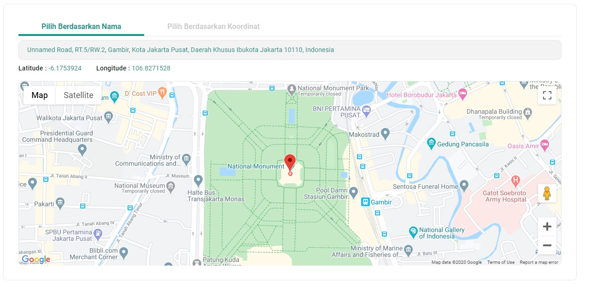

This project was bootstrapped with [Create React App](https://github.com/facebook/create-react-app).
---------------

# The purpose of this application
- User can searching address or location on map by inputting location name or coordinate(latitude and longitude)
---------------

# Step To Run This Program in Your Local Server
### 1. Create Environment
- create .env file on this project
- you can see what are environments that you should to be filled
- filled the environment with your key
- this app feature **can't be** running well if you don't input environment value

### 2. Install all dependencies
type `yarn` or `npm install` terminal

### 3. Runs the app
type `yarn start` or `npm start` terminal

Runs the app in the development mode. 
Open [http://localhost:3000](http://localhost:3000) to view it in the browser.

The page will reload if you make edits. 
You will also see any lint errors in the console.

# Apps Preview
- Home Screen

- Searching address by input location name, and its will show the place suggestion

- Searching address by input coordinate

-----------
